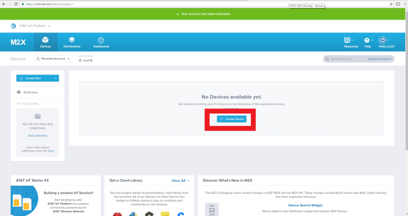
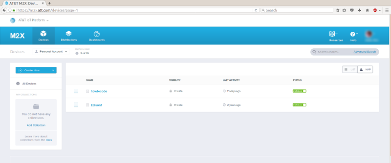
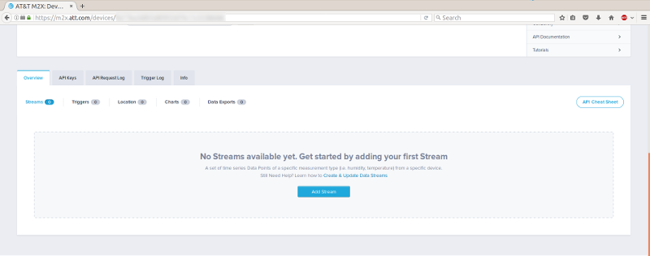
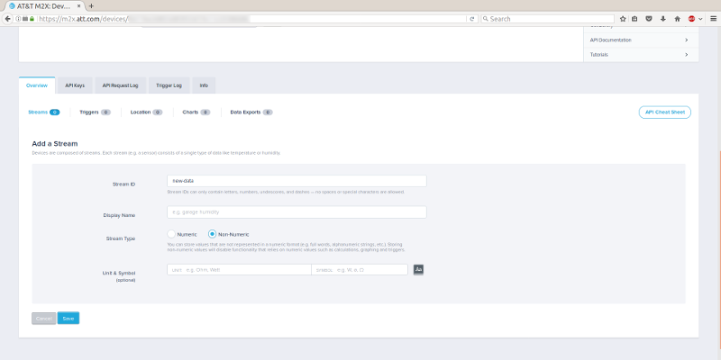
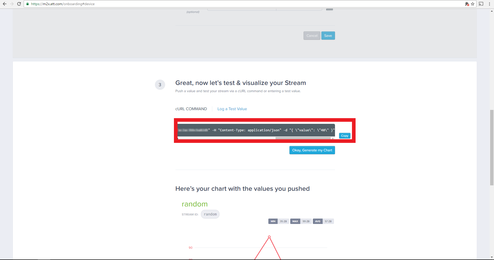
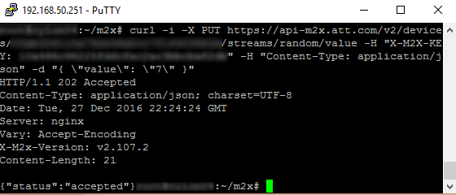

# Connecting to AT&T\* M2X\* IoT using MQTT\*

## M2X IoT initial signup

1. Create an account on https://m2x.att.com, if you do not yet have one. If you already have an account, you can skip directly to "Adding your first device" below.


2. Fill out your information when signing up.


3. Verify your email address by clicking the link in the email recieved by AT&T. (Be sure to check your spam folder, the verification is requred to continue.)


## Adding your first device

If you have a brand new account, and are adding your very first device, follow these instructions. Otherwise, skip to "Adding another device"

1. Click on the "Devices" link on the top of the page to navigate to the "Devices" page, then click on the "Create Device"


1. Select the "Select Device" button.


2. Define your device. Select "other" in the select your device dropdown box. Then continue to define your device. Make sure that you create a new Stream at the same time that you create your device.


## Adding another device

If you have an existing account, and are adding another device, follow these instructions.

1. Click on the "Devices" link on the top of the page to navigate to the "Devices" page.


2. Click on the "Create New" dropdown, and choose "Device" to display the "Create Device" dialog. Complete the needed information, then click on "Create" to define your device:


Next, add a stream for your new device.

## Adding a Stream

1. Click on the link for your new Device from the "Devices" page, then scroll down and click on the "Add Stream" button:


1. Now enter all of the needed information for your new stream:


## Testing your device (optional)

If you want to test your new device using the cURL command, follow these instructions.

1. Copy the cURL command and click the "generate my chart" button.


2. Paste the cURL command into your command line interface connected to your device and run the command.


You should now see a chart with the information you entered via the curl command on the new chart.


When you now log into AT&T M2X platform you will now be able to view all of your device information.


## Summary

If you have followed all the required steps above, you should have all the information that your program needs to connect to the M2X\* server:

- `API_KEY` - set to `<M2X Primary API Key>`.

- `DEVICE_ID` - set to `<M2X Device ID>`.

- `STREAM_ID` - set to `<M2X Stream ID>`.

## Additional setup for C++

When running your C++ code on the Intel® Edison board or Intel® IoT Gateway, you need to set the M2X\* client parameters in Intel® System Studio\*. To do that:

1. Go to **Run configurations** and, in the **Commands to execute before application** field, type the following:

        export M2X_API_KEY="[M2X API Key]"; export M2X_DEVICE_ID="[M2X Device ID]"; export M2X_STREAM_ID="[M2X Stream ID]"

2. Click the **Apply** button to save these settings.
3. Click the **Run** button to run the code on your board.

## Additional setup for JavaScript\*

When running your JavaScript\* code on the Intel® Edison board or Intel® IoT Gateway, you need to set the MQTT\* client parameters in the Intel® XDK IDE. Add the following entries to the **config.json** file:

```json
   "services": {
     "m2x": {
       "api_key": "[M2X Primary API Key]",
       "device_id": "[M2X Device ID]",
       "stream_id": "[M2X Stream ID]",
       "timeseries_zone_id": "<timeseries zone id>",
       "timeseries_ingest_url": "<timeseries ingestion ur>l"
     }
   }
```

## Additional setup for Python\*

When running your Python\* code on the Intel® Edison board or Intel® IoT Gateway, you need to set the MQTT\* client parameters on the board itself. Add the following entries to the **config.json** file:

```json
   "services": {
     "m2x": {
       "api_key": "[M2X Primary API Key]",
       "device_id": "[M2X Device ID]",
       "stream_id": "[M2X Stream ID]",
       "timeseries_zone_id": "<timeseries zone id>",
       "timeseries_ingest_url": "<timeseries ingestion ur>l"
     }
   }
```
